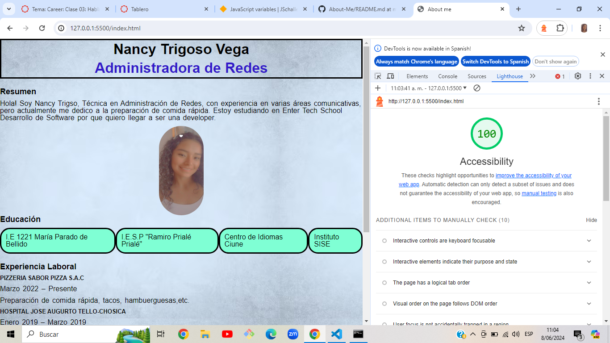

# LABORATORIO-Proyecto-Clase02
## About-Me
Esta es mi página Web sobre mi perfil con fines personales. En esta página podrás encontrar información sobre vida educativa y profesional y algunos datos curiosos.
## Autor: Nancy Trigoso Vega
### Herramientas Utilizadas:
* Visual Studio Code
* HTML
* JSCRIPT
* CSS
* Git Bash
### Instrucciones para su instalación y uso
* [Configuración del proyecto](https://entertechschool.github.io/code-201-guide/curriculum/class-02/project-setup)
* [Instrucciones sobre el proyecto](https://canvas.instructure.com/courses/9592509/assignments/46879370)
### Códigos:
* Utilizamos Const, prompt, conlog.log, if, else, alert y logramos subir el archivo local al remoto con ACP.
### Puntuación de Accesibilidad de Lighthouse

<<<<<<< HEAD
+ Punción de la fecha: 06-06-2024

=======

>>>>>>> bd189c98d4c84b37bc94dc73304345391177ecde

+ Punción de la fecha: 11-06-2024

### Licencia 
* Open-source MIT
  
### Reflexiones y Comentarios

* Son herramientas nuevas y recursos nuevos que e utilizado en esta página, son muy iportantes para el desarrollo de este proyecto y me lleva una gran enseñanza.
* Como comentario les diría que investiguen algún tema que no entiendan.
* Como comentario les diría que investiguen algún tema que no entiendan.
